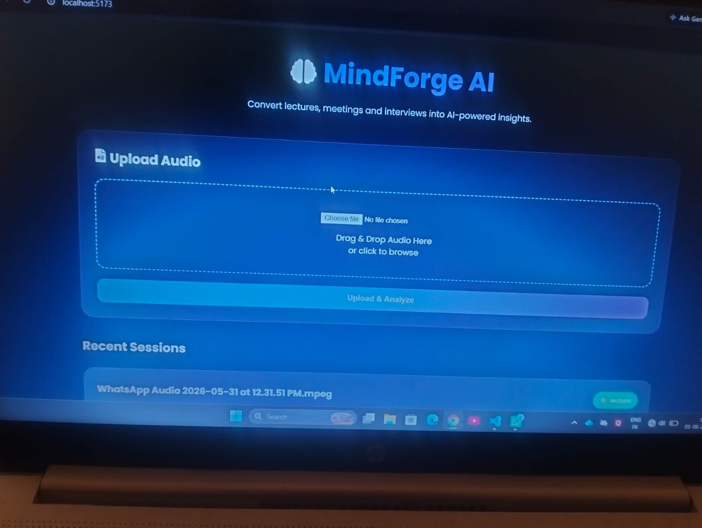
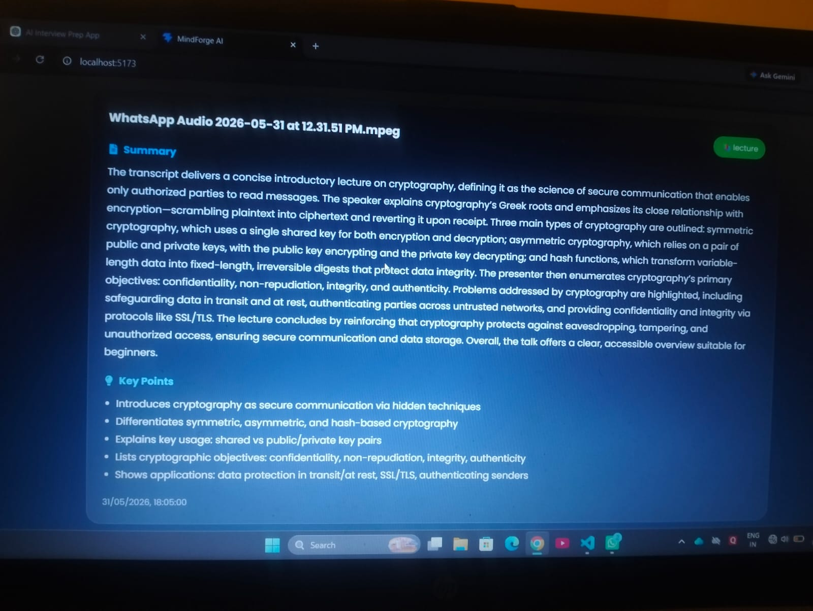
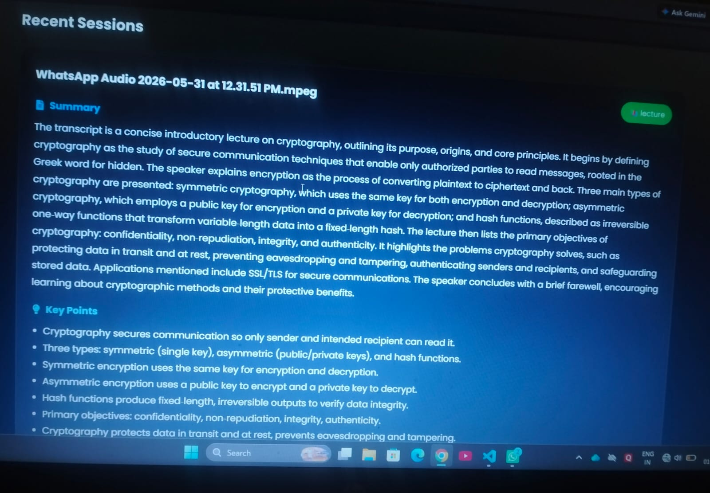

# 🧠 MindForge AI

MindForge AI is an AI-powered learning assistant that transforms audio lectures, meetings, and interviews into structured learning materials using Artificial Intelligence.

Users can upload audio recordings and automatically generate:

* 🎤 Speech-to-Text Transcripts
* 📝 AI-Powered Summaries
* ⭐ Key Learning Points
* 📚 Study Notes

---

## 🌐 Live Demo

https://mind-forge-ai-opal.vercel.app

---

## 🚀 Features

### 🎤 Audio Processing

* Upload Audio Files
* Lecture Analysis
* Meeting Analysis
* Interview Analysis
* Automatic Transcription

### 🤖 AI Analysis

* Transcript Summarization
* Key Point Extraction
* Learning Insights
* Smart Content Understanding

### 💾 Data Management

* MongoDB Atlas Integration
* Session Storage
* History Tracking

### 🎨 User Interface

* Modern React Dashboard
* Responsive Design
* Clean User Experience

---

## 🛠️ Tech Stack

### Frontend

* React.js
* Axios
* CSS

### Backend

* Node.js
* Express.js

### Database

* MongoDB Atlas
* Mongoose

### AI Services

* AssemblyAI
* OpenRouter AI

---

## ⚙️ Workflow

Audio Upload

⬇️

Speech-to-Text

⬇️

AI Analysis

⬇️

Summary & Key Points

⬇️

Dashboard Display

---

## 📸 Screenshots

### Dashboard



### Transcript Generation



### AI Summary & Insights



---

## 📂 Project Structure

```text
MindForge-AI
│
├── backend
├── frontend
├── screenshots
├── README.md
└── package.json
```

---

## 🚀 Installation

### Backend

```bash
cd backend
npm install
npm start
```

### Frontend

```bash
cd frontend
npm install
npm start
```

---

## 👨‍💻 Author

Laxmikant Yadav

GitHub: https://github.com/kanthyadav

LinkedIn: https://linkedin.com/in/laxmikant-yadav-b4443825a
