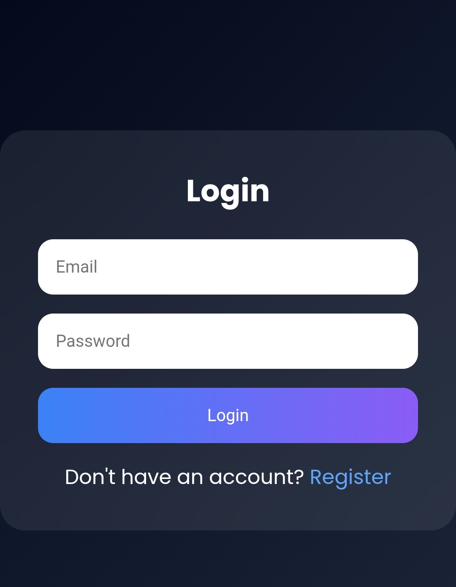
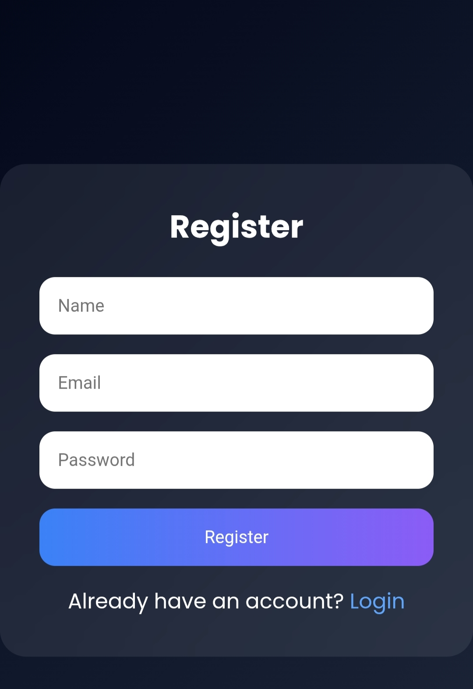
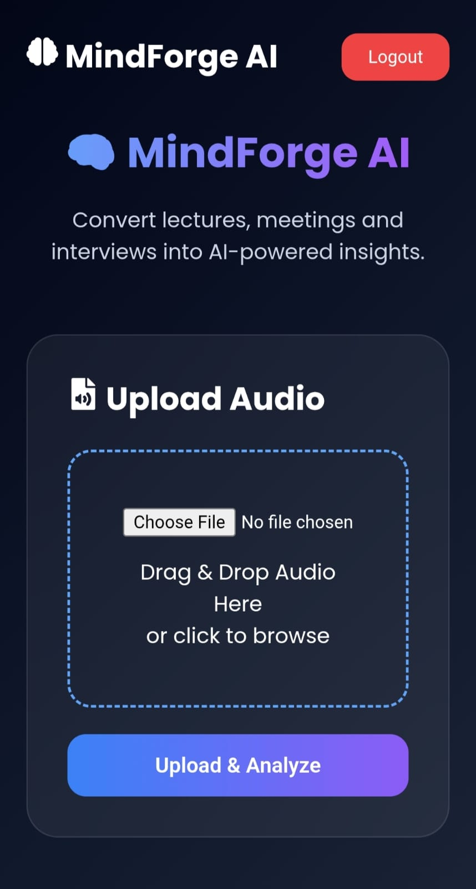
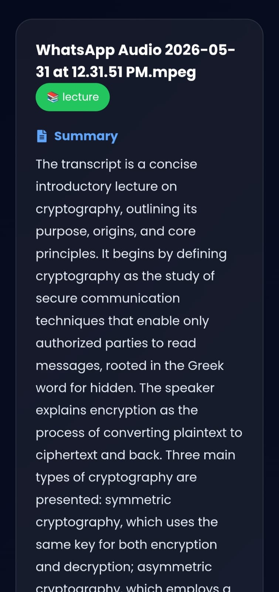
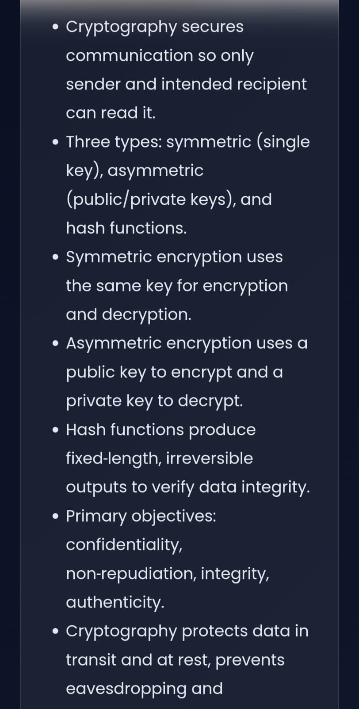

# 🧠 MindForge AI

MindForge AI is an AI-powered learning assistant that transforms audio lectures, meetings, and interviews into structured learning materials using Artificial Intelligence.

Users can upload audio recordings and automatically generate:

* 🎤 Speech-to-Text Transcripts
* 📝 AI-Powered Summaries
* ⭐ Key Learning Points
* 📚 Study Notes

---

## 🌐 Live Demo

Frontend: https://mind-forge-ai-opal.vercel.app

---

## 🚀 Features

### 🔐 Authentication

* User Registration
* User Login
* JWT Authentication
* Protected Routes
* Secure Session Management
* Logout Functionality

### 🎤 Audio Processing

* Upload Audio Files
* Lecture Analysis
* Meeting Analysis
* Interview Analysis
* Automatic Transcription

### 🤖 AI Analysis

* Transcript Summarization
* Key Point Extraction
* Learning Insights
* Smart Content Understanding

### 💾 Data Management

* MongoDB Atlas Integration
* User-Specific Sessions
* Session History Tracking
* Secure Data Storage

### 🎨 User Interface

* Modern React Dashboard
* Responsive Design
* Glassmorphism UI
* Clean User Experience

---

## 🛠️ Tech Stack

### Frontend

* React.js
* Axios
* React Icons
* CSS

### Backend

* Node.js
* Express.js
* JWT Authentication
* Multer

### Database

* MongoDB Atlas
* Mongoose

### AI Services

* AssemblyAI
* Google Gemini AI

---

## ⚙️ Workflow

Audio Upload

⬇️

Speech-to-Text Conversion

⬇️

AI Analysis

⬇️

Summary & Key Points Generation

⬇️

Dashboard Display

---

## 📸 Screenshots

### 🔐 Login Page



Modern authentication page with JWT-based user login.

---

### 📝 Register Page



User registration interface with secure account creation.

---

### 🧠 Dashboard



MindForge AI dashboard for audio uploads and AI-powered analysis.

---

### 📄 AI Transcript Generation



Automatic speech-to-text transcription generated from uploaded audio recordings using AssemblyAI.

---

### ⭐ AI Summary & Insights



AI-generated summaries, key learning points, and intelligent insights extracted from transcripts.

---

## 📂 Project Structure

```text
MindForge-AI
│
├── backend
│   ├── controllers
│   ├── middleware
│   ├── models
│   ├── routes
│   ├── services
│   └── server.js
│
├── frontend
│   ├── src
│   ├── public
│   └── package.json
│
├── screenshots
│   ├── loginmind.jpeg
│   ├── register.jpeg
│   ├── dashboard.jpeg
│   ├── mindss22.jpeg
│   └── mindss33.jpeg
│
└── README.md
```

---

## 🚀 Installation

### Clone Repository

```bash
git clone https://github.com/kanthyadav/MindForge-AI.git

cd MindForge-AI
```

### Backend Setup

```bash
cd backend

npm install

npm start
```

### Frontend Setup

```bash
cd frontend

npm install

npm run dev
```

---

## 🔑 Environment Variables

Create a `.env` file inside the backend folder.

```env
MONGO_URI=your_mongodb_connection_string

JWT_SECRET=your_secret_key

ASSEMBLY_API_KEY=your_assemblyai_api_key

GEMINI_API_KEY=your_gemini_api_key
```

---

## 🎯 Future Enhancements

* Delete Sessions
* Search Sessions
* Quiz Generation
* Revision Notes
* PDF Export
* User Profiles
* Forgot Password
* AI Chat Assistant

---

## 👨‍💻 Author

### Laxmikant Yadav

GitHub:
https://github.com/kanthyadav

LinkedIn:
https://linkedin.com/in/laxmikant-yadav-b4443825a

---

⭐ If you like this project, consider giving it a star on GitHub.
